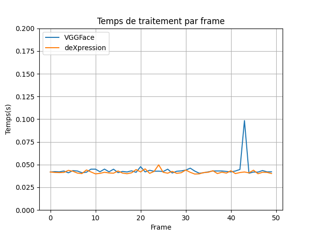

# Machine learning CNN for FER algorithm

## Introduction

This is a university project made to learn about machine learning and facial expression recognition.

The objectif of this project was to create a software using machine learning to recognize facial expressions in a real time video stream (webcam).

We used the DeXpression CNN model from this [paper](https://arxiv.org/pdf/1509.05371v2.pdf). 
We trained the model on the MMI Facial Expression Database, which is a database of videos of people expressing emotions ([link to the paper](http://www.lrec-conf.org/proceedings/lrec2010/workshops/W24.pdf#page=73)).

We also used un already trained implementation of the VGG16 model to compare the results with our model.

## Setup

### Requirements

- tensorflow
- keras
- opencv
- numpy


### Installation

Clone the repository and install the requirements:

```bash
git clone
cd FER_DeXpression
pip install -r requirements.txt
```

## Usage

You can launch the program with the following command:

```bash
python main.py --model [dex|vgg]
```

### Training

If you want to train the model, we already have a file with the features extracted from the MMI database. You can use it with the following command:

```bash
cd data
python keras_deXpression.py
```

You can also create your own dataset and train the model with it. 


## Results

We trained the model on the MMI database and we got the following results:

Log Loss | Accuracy
--- | ---
0.2 | 0.97

We can't really test the precision of the model because we don't have a test set. But we can see that the model is really precise with the training set, and in real time it seems to work well with only some emotion.

We also make a graph about the inference time of the model:




## Authors

- [Christian Tomasino](https://github.com/ChrisTom-94)
- [Maxime Dupont](https://github.com/maxime-dupont01)
- Anthony Madaleno
- Amine Mohamed Dahmouni
- Rémy Auloy
- Boris Dihn
- Quentin Isoard

